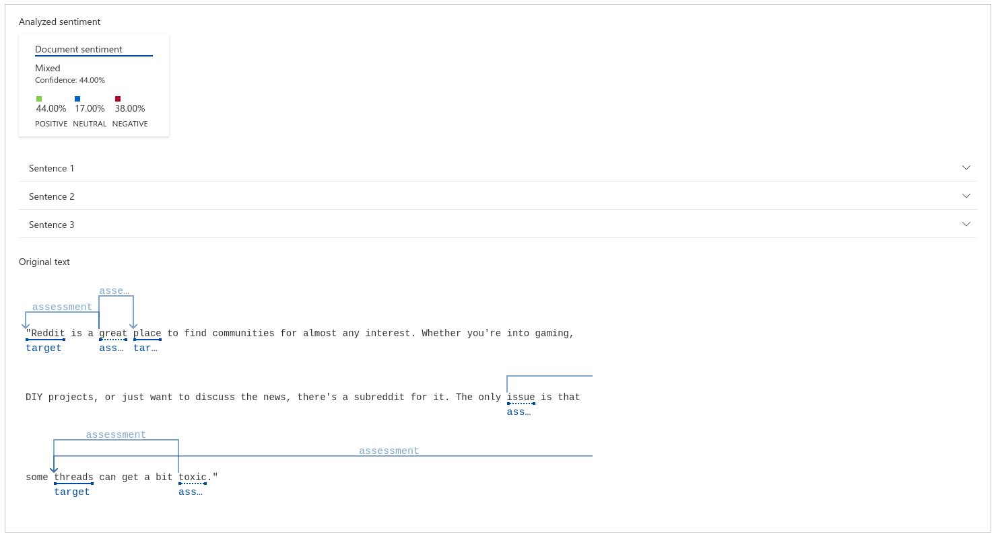
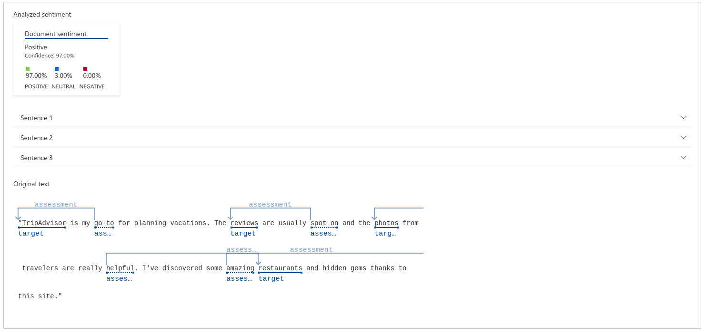
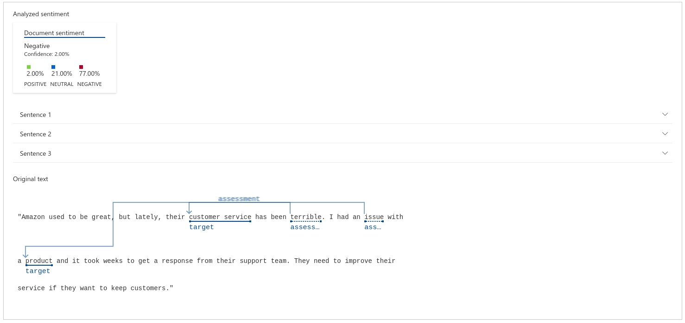

## For the purpose of learning about the Language Studio tool within Azure AI, three evaluations of fictitious services were devised using ChatGPT.

# The initial text (inputs/text1.txt) presents the following analysis:


The tool further delivers the JSON file to us in this manner:

```
{
    "documents": [
        {
            "id": "id__1323",
            "sentiment": "mixed",
            "confidenceScores": {
                "positive": 0.44,
                "neutral": 0.17,
                "negative": 0.38
            },
            "sentences": [
                {
                    "sentiment": "positive",
                    "confidenceScores": {
                        "positive": 0.88,
                        "neutral": 0.11,
                        "negative": 0.01
                    },
                    "offset": 0,
                    "length": 70,
                    "text": "\"Reddit is a great place to find communities for almost any interest. ",
                    "targets": [
                        {
                            "sentiment": "positive",
                            "confidenceScores": {
                                "positive": 1,
                                "negative": 0
                            },
                            "offset": 0,
                            "length": 7,
                            "text": "\"Reddit",
                            "relations": [
                                {
                                    "relationType": "assessment",
                                    "ref": "#/documents/0/sentences/0/assessments/0"
                                }
                            ]
                        },
                        {
                            "sentiment": "positive",
                            "confidenceScores": {
                                "positive": 1,
                                "negative": 0
                            },
                            "offset": 19,
                            "length": 5,
                            "text": "place",
                            "relations": [
                                {
                                    "relationType": "assessment",
                                    "ref": "#/documents/0/sentences/0/assessments/0"
                                }
                            ]
                        }
                    ],
                    "assessments": [
                        {
                            "sentiment": "positive",
                            "confidenceScores": {
                                "positive": 1,
                                "negative": 0
                            },
                            "offset": 13,
                            "length": 5,
                            "text": "great",
                            "isNegated": false
                        }
                    ]
                },
                {
                    "sentiment": "neutral",
                    "confidenceScores": {
                        "positive": 0.06,
                        "neutral": 0.93,
                        "negative": 0.01
                    },
                    "offset": 70,
                    "length": 104,
                    "text": "Whether you're into gaming, DIY projects, or just want to discuss the news, there's a subreddit for it. ",
                    "targets": [],
                    "assessments": []
                },
                {
                    "sentiment": "negative",
                    "confidenceScores": {
                        "positive": 0.01,
                        "neutral": 0.24,
                        "negative": 0.75
                    },
                    "offset": 174,
                    "length": 57,
                    "text": "The only issue is that some threads can get a bit toxic.\"",
                    "targets": [
                        {
                            "sentiment": "negative",
                            "confidenceScores": {
                                "positive": 0,
                                "negative": 1
                            },
                            "offset": 202,
                            "length": 7,
                            "text": "threads",
                            "relations": [
                                {
                                    "relationType": "assessment",
                                    "ref": "#/documents/0/sentences/2/assessments/0"
                                },
                                {
                                    "relationType": "assessment",
                                    "ref": "#/documents/0/sentences/2/assessments/1"
                                }
                            ]
                        }
                    ],
                    "assessments": [
                        {
                            "sentiment": "negative",
                            "confidenceScores": {
                                "positive": 0,
                                "negative": 1
                            },
                            "offset": 183,
                            "length": 5,
                            "text": "issue",
                            "isNegated": false
                        },
                        {
                            "sentiment": "negative",
                            "confidenceScores": {
                                "positive": 0,
                                "negative": 1
                            },
                            "offset": 224,
                            "length": 5,
                            "text": "toxic",
                            "isNegated": false
                        }
                    ]
                }
            ],
            "warnings": []
        }
    ],
    "errors": [],
    "modelVersion": "2022-11-01"
}
```


# The second text (inputs/text2.txt) presents the following analysis:


The tool further delivers the JSON file to us in this manner:

```
{
    "documents": [
        {
            "id": "id__1573",
            "sentiment": "positive",
            "confidenceScores": {
                "positive": 0.97,
                "neutral": 0.03,
                "negative": 0
            },
            "sentences": [
                {
                    "sentiment": "neutral",
                    "confidenceScores": {
                        "positive": 0.43,
                        "neutral": 0.55,
                        "negative": 0.02
                    },
                    "offset": 0,
                    "length": 49,
                    "text": "\"TripAdvisor is my go-to for planning vacations. ",
                    "targets": [
                        {
                            "sentiment": "positive",
                            "confidenceScores": {
                                "positive": 1,
                                "negative": 0
                            },
                            "offset": 0,
                            "length": 12,
                            "text": "\"TripAdvisor",
                            "relations": [
                                {
                                    "relationType": "assessment",
                                    "ref": "#/documents/0/sentences/0/assessments/0"
                                }
                            ]
                        }
                    ],
                    "assessments": [
                        {
                            "sentiment": "positive",
                            "confidenceScores": {
                                "positive": 1,
                                "negative": 0
                            },
                            "offset": 19,
                            "length": 5,
                            "text": "go-to",
                            "isNegated": false
                        }
                    ]
                },
                {
                    "sentiment": "positive",
                    "confidenceScores": {
                        "positive": 0.97,
                        "neutral": 0.03,
                        "negative": 0
                    },
                    "offset": 49,
                    "length": 82,
                    "text": "The reviews are usually spot on and the photos from travelers are really helpful. ",
                    "targets": [
                        {
                            "sentiment": "positive",
                            "confidenceScores": {
                                "positive": 0.97,
                                "negative": 0.03
                            },
                            "offset": 53,
                            "length": 7,
                            "text": "reviews",
                            "relations": [
                                {
                                    "relationType": "assessment",
                                    "ref": "#/documents/0/sentences/1/assessments/0"
                                }
                            ]
                        },
                        {
                            "sentiment": "positive",
                            "confidenceScores": {
                                "positive": 1,
                                "negative": 0
                            },
                            "offset": 89,
                            "length": 6,
                            "text": "photos",
                            "relations": [
                                {
                                    "relationType": "assessment",
                                    "ref": "#/documents/0/sentences/1/assessments/1"
                                }
                            ]
                        }
                    ],
                    "assessments": [
                        {
                            "sentiment": "positive",
                            "confidenceScores": {
                                "positive": 0.97,
                                "negative": 0.03
                            },
                            "offset": 73,
                            "length": 7,
                            "text": "spot on",
                            "isNegated": false
                        },
                        {
                            "sentiment": "positive",
                            "confidenceScores": {
                                "positive": 1,
                                "negative": 0
                            },
                            "offset": 122,
                            "length": 7,
                            "text": "helpful",
                            "isNegated": false
                        }
                    ]
                },
                {
                    "sentiment": "positive",
                    "confidenceScores": {
                        "positive": 0.97,
                        "neutral": 0.03,
                        "negative": 0
                    },
                    "offset": 131,
                    "length": 78,
                    "text": "I've discovered some amazing restaurants and hidden gems thanks to this site.\"",
                    "targets": [
                        {
                            "sentiment": "positive",
                            "confidenceScores": {
                                "positive": 1,
                                "negative": 0
                            },
                            "offset": 160,
                            "length": 11,
                            "text": "restaurants",
                            "relations": [
                                {
                                    "relationType": "assessment",
                                    "ref": "#/documents/0/sentences/2/assessments/0"
                                }
                            ]
                        }
                    ],
                    "assessments": [
                        {
                            "sentiment": "positive",
                            "confidenceScores": {
                                "positive": 1,
                                "negative": 0
                            },
                            "offset": 152,
                            "length": 7,
                            "text": "amazing",
                            "isNegated": false
                        }
                    ]
                }
            ],
            "warnings": []
        }
    ],
    "errors": [],
    "modelVersion": "2022-11-01"
}
```


# The tird text (inputs/text3.txt) presents the following analysis:


The tool further delivers the JSON file to us in this manner:

```
{
    "documents": [
        {
            "id": "id__1816",
            "sentiment": "negative",
            "confidenceScores": {
                "positive": 0.02,
                "neutral": 0.21,
                "negative": 0.77
            },
            "sentences": [
                {
                    "sentiment": "negative",
                    "confidenceScores": {
                        "positive": 0.01,
                        "neutral": 0.03,
                        "negative": 0.95
                    },
                    "offset": 0,
                    "length": 80,
                    "text": "\"Amazon used to be great, but lately, their customer service has been terrible. ",
                    "targets": [
                        {
                            "sentiment": "negative",
                            "confidenceScores": {
                                "positive": 0.01,
                                "negative": 0.99
                            },
                            "offset": 44,
                            "length": 16,
                            "text": "customer service",
                            "relations": [
                                {
                                    "relationType": "assessment",
                                    "ref": "#/documents/0/sentences/0/assessments/0"
                                }
                            ]
                        }
                    ],
                    "assessments": [
                        {
                            "sentiment": "negative",
                            "confidenceScores": {
                                "positive": 0.01,
                                "negative": 0.99
                            },
                            "offset": 70,
                            "length": 8,
                            "text": "terrible",
                            "isNegated": false
                        }
                    ]
                },
                {
                    "sentiment": "negative",
                    "confidenceScores": {
                        "positive": 0.03,
                        "neutral": 0.38,
                        "negative": 0.59
                    },
                    "offset": 80,
                    "length": 91,
                    "text": "I had an issue with a product and it took weeks to get a response from their support team. ",
                    "targets": [
                        {
                            "sentiment": "negative",
                            "confidenceScores": {
                                "positive": 0,
                                "negative": 1
                            },
                            "offset": 102,
                            "length": 7,
                            "text": "product",
                            "relations": [
                                {
                                    "relationType": "assessment",
                                    "ref": "#/documents/0/sentences/1/assessments/0"
                                }
                            ]
                        }
                    ],
                    "assessments": [
                        {
                            "sentiment": "negative",
                            "confidenceScores": {
                                "positive": 0,
                                "negative": 1
                            },
                            "offset": 89,
                            "length": 5,
                            "text": "issue",
                            "isNegated": false
                        }
                    ]
                },
                {
                    "sentiment": "neutral",
                    "confidenceScores": {
                        "positive": 0.42,
                        "neutral": 0.54,
                        "negative": 0.04
                    },
                    "offset": 171,
                    "length": 67,
                    "text": "They need to improve their service if they want to keep customers.\"",
                    "targets": [],
                    "assessments": []
                }
            ],
            "warnings": []
        }
    ],
    "errors": [],
    "modelVersion": "2022-11-01"
}
```